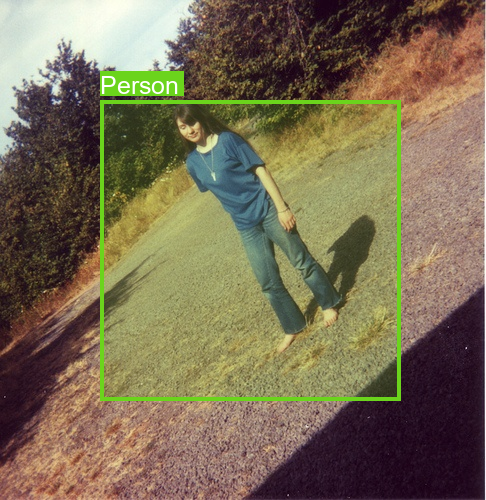
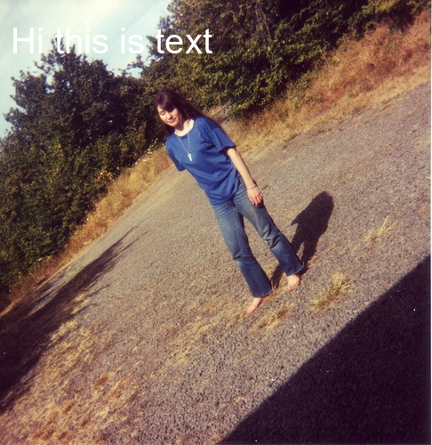
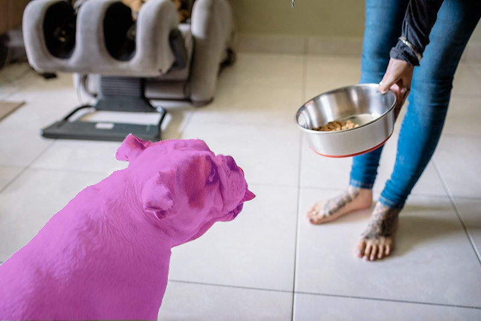

# OneShotCV

OneShotCV is a library that simplifies the visual design and rendering of computer
vision tasks such as drawing bounding boxes, masks, labels, keypoints and text.

We want to make the tailwindcss of computer vision and start focusing on the
important things rather than handling the headache of text and colors in OpenCV
and Pillow.

## Installation

```
pip install git+https://github.com/otman-ai/oneshotcv.git
```

The bundled fonts ship with the package, so nothing else is required.

## Usage

After installation you can import the package and start using it.

Every helper takes a `numpy` image (as returned by `cv2.imread`), never mutates
it, and returns a new array of the same shape and dtype.

### Bounding box with a label

```python
import cv2
from oneshotcv import Draw

image = cv2.imread("assets/image.jpg")
bbox = (100, 100, 400, 400)  # (x0, y0, x1, y1)

new_image = Draw.add_box(
    bbox,
    image,
    label="Person",
    overlayAlpha=50,  # translucent fill, 0-255
)
cv2.imwrite("image_with_bbox.png", new_image)
```



### Casual text

```python
new_image = Draw.add_text(
    image,
    "Hi this is text",
    position="top-left",   # or (x, y), or any of Draw.list_colors positions
    color="white",
    size="xl",             # xl, lg, normal, sm, xs, or an int
)
```



### Mask overlay

```python
import cv2
from oneshotcv import Draw

image = cv2.imread("assets/dog.jpg")
mask = cv2.imread("assets/mask.png", cv2.IMREAD_GRAYSCALE)

new_image = Draw.add_mask(image=image, color="pink", mask=mask, opacity=0.5)
cv2.imwrite("assets/mask_output.jpg", new_image)
```



### More primitives

```python
Draw.add_circle(image, center=(120, 120), radius=40, color="yellow", fill=True, opacity=0.4)
Draw.add_line(image, start=(0, 0), end=(200, 200), color="red", thickness=3)
Draw.add_polygon(image, points=[(20, 20), (120, 40), (80, 160)], color="cyan")
Draw.add_keypoints(image, points=[(30, 30), (60, 90)], color="pink", radius=4)
```

## Colours

Colours accept a palette name (`"green"`), a hex string (`"#6bd41c"`) or an
`(r, g, b)` tuple. OpenCV images are BGR, so every helper has a
`color_format` argument that defaults to `"bgr"`; pass `color_format="rgb"` if
you work with RGB arrays.

```python
from oneshotcv import Draw

Draw.list_colors()  # {'green': (107, 212, 28), 'white': (255, 255, 255), ...}
Draw.list_fonts()   # {'arial': '/.../fonts/arial.ttf', ...}
```

Built-in palette: `green`, `white`, `blue`, `red`, `black`, `yellow`, `pink`,
`orange`, `purple`, `cyan`, `gray`.

Built-in fonts: `arial`, `mont`, `nexa`, `coolvetica`.

## Features

- Draw a beautiful box with its label in a single line, no OpenCV/Pillow boilerplate
- Predefined colours, hex strings and RGB tuples
- Add text with a dynamic position (`center`, `top-left`, `top-right`,
  `top-center`, `bottom-right`, `bottom-left`, `bottom-center`, `right-center`,
  `left-center`) and dynamic size
- Multiple bundled fonts
- Mask overlay with an opacity option
- Circles, lines, polygons and keypoints
- Explicit `bgr` / `rgb` colour handling

## Development

```
git clone https://github.com/otman-ai/oneshotcv.git
cd oneshotcv
pip install -e ".[test]"
pytest
```

## Credits

- fonts -> https://www.dafont.com/mtheme.php?id=5

## License

The core of OneShotCV is licensed under Apache 2.0. See [LICENSE](LICENSE).

## Contribution

We would love your input to improve OneShotCV! 🙏
