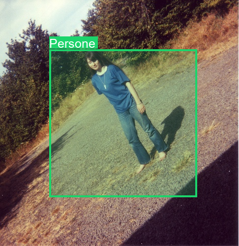

# OneShotCV
OneShotCV is a library for a simplifies visual design and rendering of computer vision tasks such as drawing bounding boxes, masks, labels, etc .

We want to make the tailwindcss of computer vision and start focusing on the important things rather then handling the headache of text and colors in opencv and Pillow .

## Installation

```
pip install git+https://github.com/otman-ai/oneshotcv.git
```

## Usage :
After installation you can import the package and start using it

```
from oneshotcv import Draw
from PIL import Image

image = Image.open("assets/image.jpg")
bbox  = (100, 100, 400, 400)
# draw bbox 
new_image = Draw.box(bbox, 
                    image,
                    label="Persone",
                    overlayAlpha=50 # in range of 0-255
                    )
# save the image
new_image.save("assets/image_with_bbox.png")
```


## Features :
- Draw a beautiful box with its label around an object in a signle line without frustriting with the parameters of opencv or Pillow
- Predifined colors to choose from 

## Milestone :
- [X] Make the repo installable as python package
- [X] create `pyproject.toml`
- [X] draw box
- [X] add text as label
- [X] add predefined colors
- [ ] Option to make the box round
- [ ] Support multiple fonts
- [ ] Add casual text with dynamic position


## © license
The core of Inference is licensed under Apache 2.0.

## Contribution
We would love your input to improve OneShotCv! 🙏