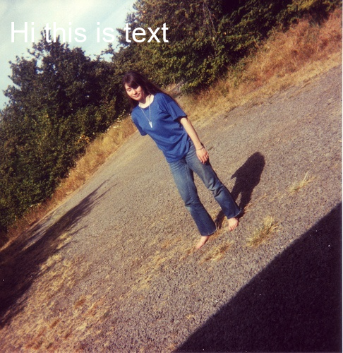

# OneShotCV
OneShotCV is a library for a simplifies visual design and rendering of computer vision tasks such as drawing bounding boxes, masks, labels, etc .

We want to make the tailwindcss of computer vision and start focusing on the important things rather then handling the headache of text and colors in opencv and Pillow .

## Installation

```
pip install git+https://github.com/otman-ai/oneshotcv.git
```

## Usage
After installation you can import the package and start using it

You can add box with its label
```python
from oneshotcv import Draw

image = cv2.imread("assets/image.jpg")
bbox  = (100, 100, 400, 400)
# draw bbox 
new_image = Draw.box(bbox, 
                    image,
                    label="Persone",
                    overlayAlpha=50 # in range of 0-255
                    )
# save the image
cv2.imwrite("assets/image_with_bbox.png", new_image)
```


Or just casual text
```python
new_image = Draw.add_text(image, "Hi this is text", 
                          position="top-left", 
                          color="white",
                          size="xl" # extra-large
                          )
```


Or even a mask
```python
from oneshotcv import Draw
import cv2

image = cv2.imread("assets/dog.jpg")
mask = cv2.imread("assets/mask.png",  cv2.IMREAD_GRAYSCALE)

new_image = Draw.add_mask(image=image,
                        color="pink",
                        mask=mask)


cv2.imwrite('assets/mask_output.jpg', new_image)
```


## Features :
- Draw a beautiful box with its label around an object in a single line without frustrating with the parameters of opencv or Pillow
- Pre-defined colors to choose from 
- add text to the image in a dynamic way , no hard coded size or position

## Milestone :
- [X] Make the repo installable as python package
- [X] create `pyproject.toml`
- [X] draw box
- [X] add text as label
- [X] add predefined colors
- [X] Add casual text with dynamic position
    - center, top-left, top-right, top-center, bottom-right, 
bottom-left, bottom-center, right-center, left-center
- [X] Support dynamic text size
- [X] Support multiple fonts
- [X] Support mask with overlay option


## © license
The core of Oneshotcv is licensed under Apache 2.0.

## Contribution
We would love your input to improve OneShotCv! 🙏
